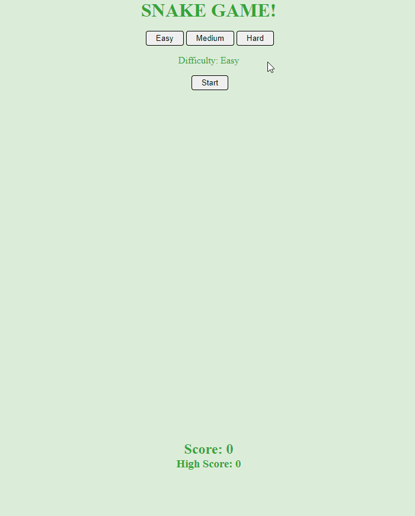

<h1 align="center"><strong>Snake Game</strong></h1>

## :bookmark_tabs: Table of contents

* <a href="#description">Description</a>
* <a href="#prerequisites">Prerequisites</a>
* <a href="#instalation">Instalation</a>
* <a href="#running">Running</a>
* <a href="#license">License</a>

## :snake: Description <a name="description"></a>

Snake game developed in a [Gabriela Pinheiro's](https://www.linkedin.com/in/gabrielapinheiro129/) class in Digital Innovation One and added more functionalities (session storage, local storage, difficulty modes, score, high score, reload).

<p align="center">
    
</p>

## :books: Prerequisites <a name="prerequisites"></a>

* [NodeJS](https://nodejs.org/en/) - JavaScript runtime environment;
* [Yarn](https://yarnpkg.com/lang/en/) or [npm](https://www.npmjs.com/) - Package Manager;

## :anchor: Instalation <a name="instalation"></a>

```bash
git clone https://github.com/rmavansi/snakegame.git
yarn
```

## :running: Running <a name="running"></a>

```bash
node server.js # Initializes server
```

## :memo: License <a name="license"></a>

The code in this project is licensed under MIT license. Read [LICENSE](LICENSE) for more details.
